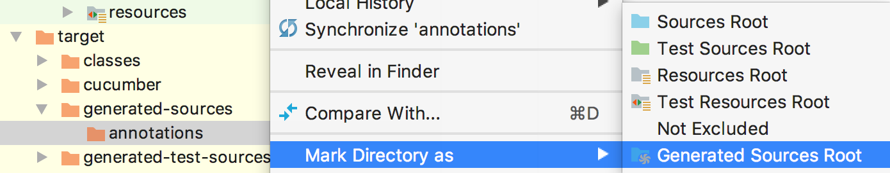
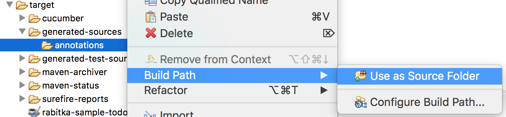
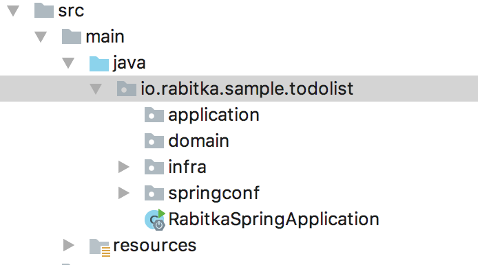
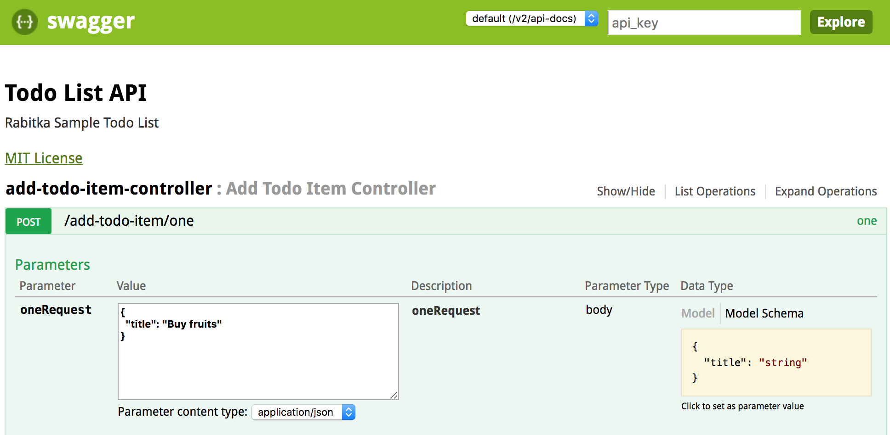

Rabitka is an open source framework for building "Domain Driven Design" application in Java. 
It provides a source code generator that simplifies application building and allows you to focus on business problems. 

# Getting started with Rabitka & Spring boot.
These quickstart instructions will help you to start creating a backend "TODO List" application using Rabitka & Spring boot.

## 1. Requirements
* [Recommended] Knowledge of "Domain Driven Design" building blocks
* JDK 1.8 or later
* Maven 3.0+ 

## 2. Import project

1. Download and unzip the source repository for this guide :
```
https://github.com/rabitka/rabitka-sample-todolist/archive/master.zip
```
Or clone it using git : 
```
git clone https://github.com/rabitka/rabitka-sample-todolist.git
```
This repository contains two projects : 
  * "complete" : complete implementation of "Todo list" application 
  * "initial" : basic code sources to start new project
2. Go to directory "initial" and run maven to download dependencies
```
cd rabitka-sample-todolist/initial
mvn clean compile 
```
3. Import the project *rabitka-sample-todolis/initial* as 'Maven Project' into your favorite IDE like Eclipse or IntelliJ
4. Add *target/generated-sources/annotations* directory to sources directories.

IntelliJ :



Eclipse :



In the project explorer we can discover the structure of packages as we see in this following picture



This structure should be respected.
* "domain" package will contains `Aggregates`.
* "application" package will contains `ApplicationServices`.

## 3. Let's go

### Specification

In this tutorial we will use **Gherkin** language to describe software's behaviour and coders three features :

First feature : ADD Todo item
```
  Scenario: Add one Todo Item
    Given an empty Todo list
    When I add a Todo Item "Buy fruits"
    Then Todo list contains only one Todo Item "Buy fruits" marked as not completed
    
  Scenario: Add invalid Todo Item
    Given an empty Todo list
    When I add an empty Todo Item
    Then An error is thrown
    And todo list is empty
```

Second feature : Get Todo item
``` 
  Scenario: Get all
    Given The Todo list contains completed Todo Item "Buy fruits"
    Given The Todo list contains not completed Todo Item "Walk the dog"
    When I get all Items
    Then I obtains Todo Items "Buy fruits" and "Walk the dog"
``` 

Third feature : Change Todo item title
``` 
  Scenario: Change title
    Given The Todo list contains only Todo Item "Buy fruits"
    When I change title of Todo Item "Buy fruits" by "Buy fresh fruits"
    Then Todo list contains only Todo Item "Buy french fruits"
    
  Scenario: Change title by empty title
    Given The Todo list contains only Todo Item "Buy fruits"
    When I change title of Todo Item "Buy fruits" by ""
    Then An error is thrown
    And Todo list contains only Todo Item "Buy fruits"
``` 

### Implementation

#### First feature : ADD Todo item

For the first scenario we need to create an `AggregateRoot` "TodoItem" with two fields :
* "title" : String contains a short description of TodoItem
* "completed" : Boolean flag to indicate if the TotdoItem is completed or not.


```java
package io.rabitka.sample.todolist.domain;

import io.rabitka.core.ddd.*;

@AggregateRoot
public class TodoItem implements IEntity<TodoItem.Id> {

    private Id id = new Id();
    private String title;
    private Boolean completed = Boolean.FALSE;

    @Factory
    public TodoItem(Id id, String title, Boolean completed) {
        this.id = id;
        this.title = title;
        this.completed = completed;
        this.validate();
    }

    public TodoItem.Id getId() {
        return id;
    }

    public String getTitle() {
        return title;
    }

    public Boolean getCompleted() {
        return completed;
    }

    @Override
    public void validate() {

    }

    @IdentityAnnotation
    public static class Id extends UniqueValueIdentity {
        public Id(String value) {
            super(value);
        }

        public Id() {
        }
    }
}
```

1. Create TodoItem class
2. Create Id class
3. Add fields 
4. Add getters
5. Implements interface `IEntity`
6. Create constructor and add _this.validate();_ as the last instruction.
7. Add "AggregateRoot" annotation
8. run command :
```shell
mvn clean compile
```
9. Use generated classes (TodoItemValidator, TodoItemBase) to complete implementation of validate equals and hashCode methods :
```java
    @Override
    public void validate() {
        TodoItemValidator.validate(this);
    }

    @Override
    public boolean equals(Object obj) {
        return TodoItemBase.equals(this, obj);
    }

    @Override
    public int hashCode() {
        return TodoItemBase.hashCode(this);
    } 
```
<br />

>          
> In compilation step, TodoItem will be parsed and for each specific annotation one or more classes will be generated :
>
> * `@AggregateRoot` :
>   * TodoItemBase : contains equals and hashCode methods
>   * TodoItemValidator : permit to check the integrity of TodoItem object or of one of his field 
>   * TodoItemRepository : every AggregateRoot will have his Repository. Repository will allow you to perform various data access operations.
>   * TodoItemPredicates : permit to build object query used within repository to find objects by criteria.
> * `@Factory` :
>   * TodoItemFactory : provide builders, helpful for code clarity.

<br />

Now we can start implementation of application service :
1. Under package application, we create AddTodoItem application service
2. Add generated class TodoItemRepository as field. 
3. Add constructor. Application service should have only one Constructor to inject all repositories.
In parameter of constructor we should put full name of repository class, with package name (io.rabitka.sample.todolist.domain.TodoItemRepository)
4. We implement "Add one Todo Item" : public void one(String title) 

```java
package io.rabitka.sample.todolist.application;

import io.rabitka.core.ddd.ApplicationService;
import io.rabitka.sample.todolist.domain.TodoItem;
import io.rabitka.sample.todolist.domain.TodoItemFactory;
import io.rabitka.sample.todolist.domain.TodoItemRepository;

@ApplicationService
public class AddTodoItem {

    private TodoItemRepository todoItemRepository;

    public AddTodoItem(
        io.rabitka.sample.todolist.domain.TodoItemRepository todoItemRepository) {
        this.todoItemRepository = todoItemRepository;
    }

    public void one(String title) {
        this.todoItemRepository.put(
            TodoItemFactory.defaultBuilder()
                .setId(new TodoItem.Id())
                .setTitle(title)
                .setCompleted(Boolean.FALSE)
                .build()
        );
    }

}
```

#### Second feature : Get Todo item
We add new application service GetTodoItem :
```java
package io.rabitka.sample.todolist.application;

import io.rabitka.core.ddd.ApplicationService;
import io.rabitka.sample.todolist.domain.TodoItem;
import io.rabitka.sample.todolist.domain.TodoItemRepository;

import java.util.List;

@ApplicationService
public class GetTodoItem {

    private TodoItemRepository todoItemRepository;

    public GetTodoItem(
        io.rabitka.sample.todolist.domain.TodoItemRepository todoItemRepository) {
        this.todoItemRepository = todoItemRepository;
    }

    public List<TodoItem> all() {
        return this.todoItemRepository.getAllInList();
    }

}

```

Testing 
```
mvn clean package
java -jar target/rabitka-sample-todolist-init-0.0.1-SNAPSHOT.jar
```
Now that the application is running, you can test it. 
Open link http://localhost:8080/swagger-ui.html on your browser

<br/>

> As you might have guessed spring configuration was automatically generated (ApplicationServicesFactory and RepositoriesFactory).
> Also, for each Application Service one Controller (@RestController) was generated

<br />

#### Feature: ADD Todo item / Scenario: Add invalid Todo Item   

Now we will implement the business rule **empty title is invalid** specified in second scenario *"Add invalid Todo Item"*
We just need to add a Metatype annotation
```java
    @StringMetatype(blank = false)
    private String title;
```
by adding @StringMetatype annotation to title the content of this field will be checked by the constructor and throw 
InvalidDomainObjectException when this value is empty (blank).

#### Feature: Change Todo item title   

To TodoItem we add method changeTitle and we used TodoItemValidator to assure the second scenario *"Change title by empty title"* 
```java
    public void changeTitle(String title) {
        TodoItemValidator.validateTitle(title).throwIfInvalid();
        this.title = title;
    }
``` 

Application service :
```java
package io.rabitka.sample.todolist.application;

import io.rabitka.core.ddd.ApplicationService;
import io.rabitka.sample.todolist.domain.TodoItem;
import io.rabitka.sample.todolist.domain.TodoItemRepository;

import static io.rabitka.sample.todolist.domain.TodoItemPredicates.idIsEqualsTo;

@ApplicationService
public class ChangeTodoItemTitle {

    private TodoItemRepository todoItemRepository;

    public ChangeTodoItemTitle(
            io.rabitka.sample.todolist.domain.TodoItemRepository todoItemRepository) {
        this.todoItemRepository = todoItemRepository;
    }

    public void byId(TodoItem.Id id, String title){
        this.todoItemRepository
            .findBy(idIsEqualsTo(id))
                .updateEach(
                    todoItem -> todoItem.changeTitle(title)
                );
    }

}
```


## 4. Repository Provider 

Repository allow us to perform various data access operations, but in reality every Repository need a Provider.
In this project we activate `InMemoryProvider` by setting **spring.profiles.active** parameter in **application.properties** file.
```
spring.profiles.active=InMemoryProvider
```

We can switch easily to `SqlProvider` by setting **spring.profiles.active** parameter
and adding sql script to create database :


src/main/resources/application.properties
```
spring.profiles.active=SqlProvider
```

src/main/resources/db.sql
```sql 
CREATE TABLE TodoItem
(
  id_value             CHAR(100) NOT NULL,
  title                CHAR(100),
  completed            BOOLEAN
);
CREATE UNIQUE INDEX TodoItem_id_uindex
  ON TodoItem (id_value);
```

This feature is very helpful, when we run test of application layer we use InMemoryProvider and in QA or production we use SqlProvider. 
